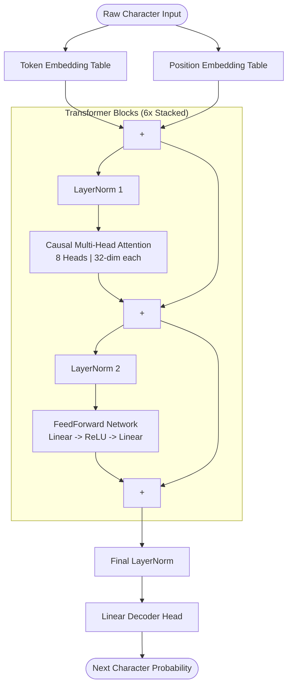

# toy-gpt

<p align="center">
  
  
  
  
</p>

A clean, minimalist, multi-layer character-level GPT transformer written in raw PyTorch.

This repository is designed to be completely transparent and easily hackable. The entire architecture lives in `transformer.py` without layers of deep-learning abstractions, making it simple to pull apart, study, and play with. 

As a case study, the model provided here is a **5.22M parameter Small Language Model (SLM)** trained entirely on the text corpus of the *Mann Ki Baat* radio broadcasts. It learns to read and generate alternating English and Hindi/Devanagari text purely from raw character sequences.

## Architecture

The model is a decoder-only transformer with causal self-attention. Below is the block-level data flow of the architecture:



---

## Model Configuration & Budget

To run this comfortably on consumer hardware (like an Apple Silicon MacBook), the configuration is constrained to a tight budget:

| Hyperparameter | Value | Description |
| :--- | :---: | :--- |
| `block_size` | **128** | Maximum look-back context (in characters) |
| `n_embd` | **256** | Embedding workspace dimension |
| `n_head` | **8** | Multi-head attention heads (32 dims per head) |
| `n_layer` | **6** | Stacked transformer blocks |
| **Total Parameters** | **5,226,880** | Combined parameter footprint |

```python
# Defined in transformer.py
block_size = 128    
n_embd     = 256    
n_head     = 8      
n_layer    = 6      
```

---

## Why Character-Level?

Modern production LLMs use Byte-Pair Encoding (BPE) or sub-word tokenizers to compress language. While efficient, it hides the actual text mechanics. 

By training directly on raw characters, the network starts with zero knowledge of language. It doesn't know what a space is, how words are constructed, or where alphabet boundaries lie. Watching a 5.2M parameter brain allocate its internal attention map to first solve basic spelling and then macro-syntax is incredibly rewarding.

---

## Training Log & Lessons Learned

### Loss Progression
| Step | Training Loss | Milestone |
| :--- | :---: | :--- |
| `0` | `4.32` | Random initialization |
| `1,000` | `2.15` | Model begins clustering common words |
| `3,000` | `1.54` | Spelling of English/Hindi words starts forming |
| `5,000` | `1.28` | Local syntax and punctuation mastered |
| `8,000` | `1.10` | Final convergence; stable bilingual generation |

1. **The spelling tax:** In early iterations, I experimented with a tiny footprint (`block_size = 64`, `n_embd = 128`). The cross-entropy loss aggressively flattened out around 1.38. Because the vocabulary spans both Latin characters and the Devanagari script, a massive chunk of the network's capacity was burned entirely on learning word boundaries and spelling. It didn't have enough residual "brain capacity" left to learn grammar, resulting in phonetically sound but completely hallucinated words.
2. **Scaling the workspace:** To give the model structural breathing room, I scaled up to the current 6-layer configuration and pushed it through an 8,000-step optimization loop using the `mps` backend (Apple Silicon GPU acceleration). The loss successfully plummeted to a stable 1.10, signaling that the model had completely mastered spelling and was beginning to map vocabulary distribution.

---

## The Sampling Problem (and the Fix)

If you use vanilla softmax sampling on a character model, the outputs quickly dissolve into a chaotic mess. 

Even if the network assigns a tiny 0.5% probability to a completely random character, over a generation length of several hundred characters, the model will eventually roll that 200-to-1 shot. The moment it selects a bad character, the context window shifts, the past memory becomes corrupted, and the model goes into a permanent hallucination spiral.

To tame this, `interactive_demo.py` implements a tight inference loop:

* **Temperature Scaling (0.7):** Lowers the entropy of the softmax distribution, sharpening the model's confidence in its top choices.
* **Top-K Filter (10):** Ruthlessly chops off the probability tail. The model is physically blocked from ever sampling past its top 10 best guesses, eliminating rogue character generation entirely.

---

## 🚀 Quick Start

You don't need an expensive GPU cluster to play with this. The pre-trained weights (`model_weights.pth`) are committed directly to the repo.

### 1. Clone the Repository
```bash
git clone https://github.com/prachisawan/toygpt.git
cd toygpt
```

### 2. Run the Generator
Launch the interactive shell to prime the model:
```bash
python interactive_demo.py
```

Provide a prompt to watch the model autocomplete the narrative rhythm of the dataset:
```text
Prompt: मेरे प्यारे देशवासियों
Output: मेरे प्यारे देशवासियों, आज हमारे देश में स्वच्छता एक स्वभाव बन गया है। इस आंदोलन ने नागरिकों के संकल्प को एक नई ऊर्जा दी है। खेल के मैदान से लेकर विज्ञान के क्षेत्र तक, हमारे युवा लगातार नए कीर्तिमान स्थापित कर रहे हैं...
```

> [!NOTE]
> **Limitations:** Because the `block_size` is limited to 128 characters, the model can only look back about 20–25 words at any given moment. It will nail localized sentence structure and seamlessly swap between English and Hindi, but its macro-thematic coherence will drift over long paragraphs. Type `exit` to quit the interface.

---

## 📂 Repository Structure

The codebase is minimal and completely stripped of boilerplate:

* **[transformer.py](file:///Users/prachisawan/toy-gpt/transformer.py):** The core mathematical blueprint. Defines the causal Multi-Head Self-Attention, the FeedForward layers, LayerNorm, and the sequential GPT blocks.
* **[train.py](file:///Users/prachisawan/toy-gpt/train.py):** The training environment, setting up the custom data batching loop and handling optimization steps.
* **[interactive_demo.py](file:///Users/prachisawan/toy-gpt/interactive_demo.py):** Light user interface tracking text generation, input framing, and the Temperature/Top-K sampling mechanics.